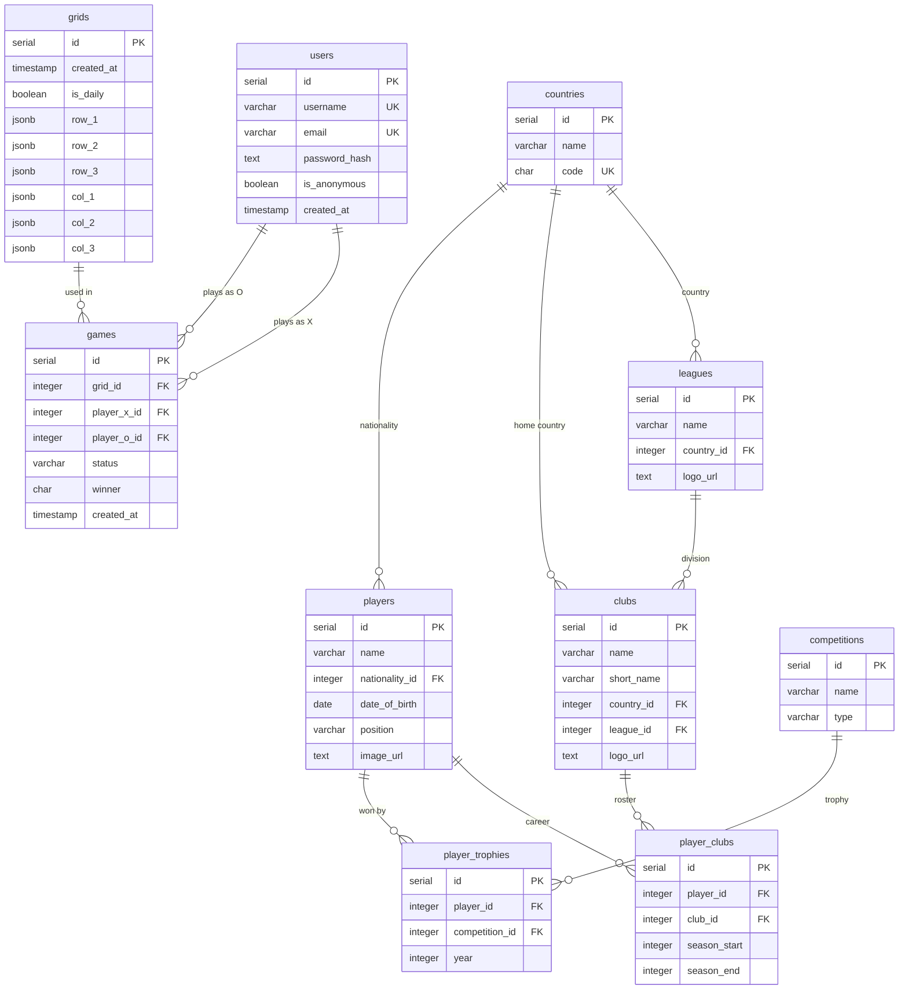

# ⚽ Football Tic-Tac-Toe

A real-time multiplayer football trivia game. Players take turns claiming cells on a 3x3 grid by naming a footballer who matches both the row and column criteria — for example, *"played for Real Madrid AND is French."* First to get three in a row wins.

Inspired by [Tiki-Taka-Toe](https://playfootball.games/footy-tic-tac-toe/).

🔗 **[Play it live](#)** · [Report a bug](https://github.com/offri1berger/football-tic-tac-toe/issues)

---

## Features

- **Real-time multiplayer** — play against a friend online via WebSockets
- **Daily challenge** — a new grid generated every midnight for solo play
- **Fuzzy player search** — typos are forgiven, powered by PostgreSQL `pg_trgm`
- **Anonymous play** — no signup required to jump into a game
- **Rarity scores** — see how many valid answers exist per cell after the game

---

## Tech Stack

### Frontend
| Technology | Purpose |
|---|---|
| React + TypeScript | UI framework |
| Vite | Build tool |
| Tailwind CSS + shadcn/ui | Styling and components |
| Zustand | UI state management |
| TanStack Query | Server state and caching |
| socket.io-client | Real-time WebSocket client |
| Framer Motion | Animations |

### Backend
| Technology | Purpose |
|---|---|
| Node.js + Express | Server framework |
| TypeScript | Type safety |
| Socket.io | WebSocket server |
| Kysely | Type-safe SQL query builder |
| BullMQ | Daily grid generation job queue |
| JWT | Authentication |
| Pino | Logging |
| Zod | Request validation |
| Swagger | API documentation |
| Sentry | Error monitoring |

### Infrastructure
| Technology | Purpose |
|---|---|
| PostgreSQL + pg_trgm | Main database + fuzzy search |
| Redis | Ephemeral game state + BullMQ |
| Docker Compose | Local development |
| Railway | Production deployment |
| GitHub Actions | CI/CD pipeline |

---

## Architecture

A **monolith** — one Node.js server handles both the REST API and WebSocket connections. Chosen deliberately: the app has no independent scaling requirements, and a clean monolith demonstrates better engineering judgment than unjustified microservices.

```
[React Client]
      ↕ HTTP (Axios)        → non-real-time: create room, validate answer
      ↕ WebSocket (socket.io) → real-time: opponent joined, turn change, game over

[Node.js Server — Express + Socket.io]
      ↕                    ↕
[PostgreSQL]            [Redis]
 permanent data          ephemeral game state
 players, clubs          active rooms
 game results            BullMQ job queue
```

**Why Redis?** Active game state changes constantly and doesn't need to survive a server restart. Redis responds in under 1ms vs 5-20ms for PostgreSQL. Rule: permanent data → PostgreSQL, ephemeral fast data → Redis.

---

## Database Schema



---

## Project Structure

```
football-tic-tac-toe/
├── client/                   # React frontend
│   └── src/
│       ├── components/       # Reusable UI components
│       ├── pages/            # Home, Game, Lobby, Auth
│       ├── hooks/            # Custom React hooks
│       ├── services/         # Axios + socket.io logic
│       └── store/            # Zustand global state
│
├── server/                   # Node.js backend
│   ├── src/
│   │   ├── routes/           # URL definitions
│   │   ├── controllers/      # Request/response handling
│   │   ├── services/         # Business logic
│   │   ├── websocket/        # Socket.io event handlers
│   │   ├── db/               # Kysely queries
│   │   └── cache/            # Redis logic
│   └── migrations/           # Database migrations
│
├── shared/                   # Shared TypeScript types
└── docker-compose.yml        # Local PostgreSQL + Redis
```

---

## Getting Started

### Prerequisites
- Node.js 20+
- pnpm
- Docker Desktop

### Installation

```bash
# Clone the repo
git clone https://github.com/offri1berger/football-tic-tac-toe.git
cd football-tic-tac-toe

# Install dependencies
pnpm install

# Start PostgreSQL and Redis
docker compose up -d

# Set up environment variables
cp server/.env.example server/.env
cp client/.env.example client/.env

# Run database migrations
cd server && pnpm migrate:up

# Start the app
pnpm dev
```

The client runs on `http://localhost:5173` and the server on `http://localhost:3000`.

---

## API Documentation

Once the server is running, visit `http://localhost:3000/api-docs` for the full Swagger documentation.

---

## Key Engineering Decisions

**Why not microservices?**
The app has no independent scaling needs. Microservices would add networking complexity and deployment overhead without any benefit at this scale.

**Why Kysely instead of an ORM?**
Kysely is a type-safe query builder that stays close to raw SQL. Using an ORM like Prisma would hide the SQL, which defeats the purpose of demonstrating real database knowledge.

**Why BullMQ?**
BullMQ runs on top of Redis (already in the stack) and handles the daily grid generation job that runs every midnight. A real production pattern with zero additional infrastructure.

**Why pg_trgm?**
PostgreSQL's trigram extension enables fuzzy text search. When a user types "Ronlado" we still find "Cristiano Ronaldo." One line to enable, no external search service needed.

---

## License

MIT
